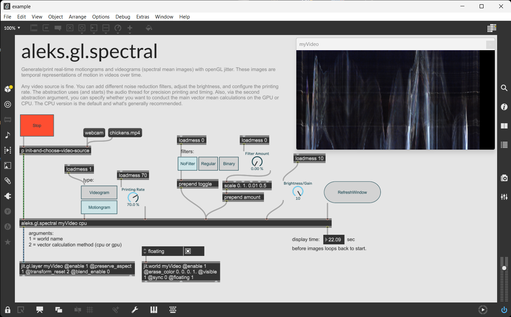
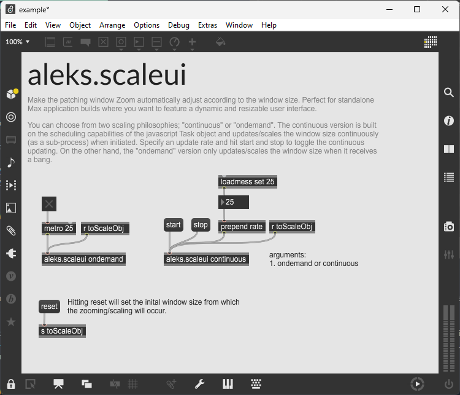

1. [aleks.ksync](#aleksksync) - Syncronize sine waves based on the Kuramoto model
2. [aleks.gl.spectral](#aleksglspectral) - Real-time motiongrams (spectral mean images) using openGL jitter.
3. [aleks.multiplot.js](#aleksmultiplotjs) - Plotting tool for visualizing lists in Max.
4. [aleks.scaleui](#aleksscaleui) - Make the Max patching window automatically adjust Zoom according to the window size.
5. [aleks.multislider](#aleksmultislider) - A modified and customizable version of Max's multislider object.

# aleks.ksync

**Type:** Abstraction

A multi-channel DSP Max abstraction for synchronizing n-number of sine waves (oscillators) based on the Kuramoto model. The model describes the synchronization behavior of a generalized system of interacting oscillators.

Specify the number of oscillators as the object argument and their fundamental frequency through the first inlet. Then, toggle sine waves at arbitrary times (using sig~ 1's) and commence the synchronization process by providing a normalized k-value (coupling constant). The higher this k-value, the quicker the synchronization process occurs.

<p align="left">
 
</p>

### Related articles

- [Synchronization of Globally Coupled Nonlinear Oscillators:the Rich Behavior of the Kuramoto Model](http://go.owu.edu/~physics/StudentResearch/2005/BryanDaniels/kuramoto_paper.pdf)

### Contributors

- [Balint Laczko](https://github.com/balintlaczko)

# aleks.gl.spectral

Generate/print real-time motiongrams and videograms (spectral mean images) with openGL jitter. These images are temporal representations of motion in videos over time.

Any video source is fine. You can add different noise reduction filters, adjust the brightness, and configure the printing rate. The abstraction uses (and starts) the audio thread for precision printing and timing. You can also specify if you want to conduct the main vector mean calculations on the GPU (via [jit.gl.pix]) or CPU (via [xray.jit.mean]). The CPU version is the default and what's generally recommended (this is also documented by [the Cyling74 website](https://cycling74.com/tutorials/best-practices-in-jitter-part-1)).

<p align="left">
 
</p>

<!-- 440 -->

### Related articles

- Jensenius, Alexander Refsum (2005). [Developing Tools for Studying Musical Gestures within the Max/MSP/Jitter Environment](https://www.duo.uio.no/handle/10852/26907). Proceedings of the International Computer Music Conference, p. 282-285.

### Related applications

- [VideoAnalysis](https://github.com/fourMs/VideoAnalysis)
- [AudioVideoAnalysis](https://github.com/fourMs/AudioVideoAnalysis)

### Dependencies

XRAY external package

# aleks.multiplot.js

**Type:** jsui file

An easy-to-use dynamic plotting tool for visualizing lists of numbers in Max. The object is an upgraded and enhanced version of Timothy Place's `plot.js` built with the [jsui] Max object.

To use it, create a [jsui] object in Max and load it with the `aleks.multiplot.js` file.

The interface can plot an arbitrary number of lists and will render the content of each list (the number values) on the Y-axis and the list indices on the X-axis. You can also design the plotting interface in many cool ways, assign a custom color to your lists, add axis titles and labels, and write the data directly to a Max dictionary.

<p align="left">
 
</p>

### Related applications

- [Hardanger Fiddle Performance Analysis](https://github.com/aleksati/hardanger-fiddle-performance-analysis)

# aleks.scaleui

**Type:** Abstraction

Make the Max patching window automatically adjust Zoom according to the window size. Perfect for standalone Max application builds where you want a dynamic and resizable user interface.

You can choose from two scaling philosophies; "continuous" or "ondemand". The continuous version reads and updates/scales the window size continuously (as a sub-process) when initiated by a "start" message. You can also specify the update rate in ms. The "ondemand" version only updates/scales the window size when it receives bangs.

<p align="left">
 
</p>

# aleks.multislider.js

**Type:** jsui file

```diff
! Under development...!
```

A modified and customizable version of Max's [multislider] object built with the [jsui] object.
