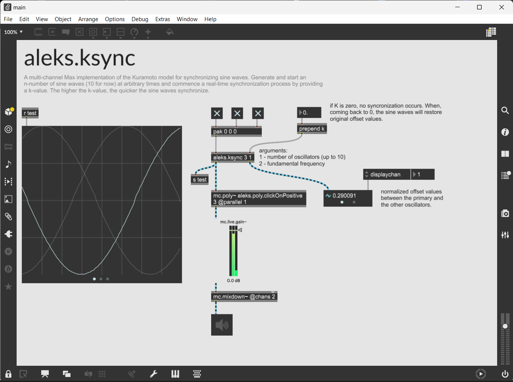
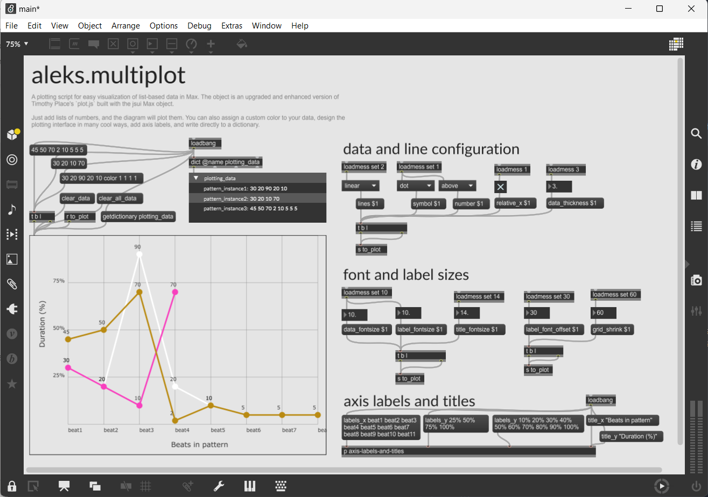

# aleks.ksync

**Type:** Abstraction

A multi-channel Max implementation of the Kuramoto model for synchronizing oscillators. The model produces a smooth, scalable and consistent audio-rate syncronization in real-time.

Specify the number of oscillators and their fundamental frequency as object arguments. Then, toggle the various sine waves at arbitrary times via lists of 0's and 1's and commence the synchronization process by providing a k-value. The higher the k-value (between 0 and 1), the quicker the synchronization process occurs. Thus far, the abstraction is restricted to a maximum of 10 channels.

<p align="left">
 
</p>

### Related articles

- [Synchronization of Globally Coupled Nonlinear Oscillators:the Rich Behavior of the Kuramoto Model](http://go.owu.edu/~physics/StudentResearch/2005/BryanDaniels/kuramoto_paper.pdf)

# aleks.gl.motiongram

**Type:** Patches

Generate real-time spectral mean images (motiongrams and videograms) with openGL jitter. Motiongrams are temporal representations of motion in videos over time.

Two methods are included. Their use is dependent on whether you want to conduct vector mean calculations on the GPU or CPU. If you want something stable that can accommodate various resolutions, you should go for the CPU version. This is also documented by [the Cyling74 website](https://cycling74.com/tutorials/best-practices-in-jitter-part-1). However, if you're only processing relatively low resolution video and want to utilize most of your CPU power elsewhere, you should opt for the GPU version.

<p align="left">
 
</p>

<!-- 440 -->

### Related applications

- [VideoAnalysis](https://github.com/fourMs/VideoAnalysis)
- [AudioVideoAnalysis](https://github.com/fourMs/AudioVideoAnalysis)

### Dependencies

XRAY external package

# aleks.multiplot

**Type:** jsui

An easy-to-use dynamic plotting tool for visualizing list-based data in Max. The object is an upgraded and enhanced version of Timothy Place's `plot.js` built with the jsui Max object.

When adding lists of numbers the plot object will plot the list numbers on the Y-axis and the list indices on the X-axis. You can also assign a custom color to your list data, design the plotting interface in many cool ways, add axis titles and labels, and write directly to a dictionary. 

<p align="left">
 
</p>

# aleks.scaleUI

**Type:**

Make the zoom in Max automatically scale based on the window size. In other words, resizing the max window will automatically adjust the zoom. Built with the [js] object.

Two methods are included.

# aleks.multislider

**Type:** jsui

```diff
! Under development...!
```

A modified and customizable version of Max' [multislider] object. Built with the [jsui] object.
